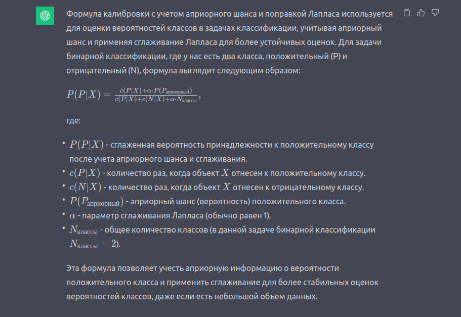

# Лабораторная работа №1

0) cформировать два массива данных на основе таблицы V8.csv:
- массив количественных данных (все количественные данные оставить без
изменений, для всех качественных данных кроме переменной класса1 произвести
калибровку с учетом априорного шанса с поправкой Лапласа, значения переменной
класса задать как 1, если положительный класс, 0 иначе);
- массив качественных данных (для всех качественных данных кроме переменной
класса произвести калибровку с учетом априорного шанса с поправкой Лапласа,
значения переменной класса задать как 1, если положительный класс, 0 иначе; для
всех количественных данных произвести дискретизацию с равной частотой, в
качестве границ интервалов взять выборочные квантили порядка 0, 0.2, 0.4, 0.6, 0.8,1)

#### Дискретизация данных

Предположим, у нас есть следующие числовые данные:

400,100,2000,300,22,132,555400,100,2000,300,22,132,555

    Сортировка данных: Сначала упорядочим данные в порядке возрастания:

22,100,132,300,400,555,200022,100,132,300,400,555,2000

    Выбор квантилей: Мы хотим разделить данные на интервалы, используя выборочные квантили порядка 0, 0.2, 0.4, 0.6, 0.8 и 1. Это означает, что мы разделим данные так, чтобы 20% значений попадали в первый интервал, 20% во второй интервал и так далее.

    Вычисление квантилей: Найдем значения квантилей:

    Q0=22Q0​=22 (минимальное значение)
    Q0.2=100Q0.2​=100 (20-й перцентиль)
    Q0.4=132Q0.4​=132 (40-й перцентиль)
    Q0.6=300Q0.6​=300 (60-й перцентиль)
    Q0.8=555Q0.8​=555 (80-й перцентиль)
    Q1=2000Q1​=2000 (максимальное значение)

Теперь у нас есть границы интервалов:

    Интервал 1: x≤100x≤100 (20% данных)
    Интервал 2: 100<x≤132100<x≤132 (20% данных)
    Интервал 3: 132<x≤300132<x≤300 (20% данных)
    Интервал 4: 300<x≤555300<x≤555 (20% данных)
    Интервал 5: 555<x≤2000555<x≤2000 (20% данных)

    Дискретизация данных: Теперь мы можем присвоить каждому значению соответствующий интервал:

    400 попадает в интервал 4.
    100 попадает в интервал 1.
    2000 попадает в интервал 5.
    300 попадает в интервал 4.
    22 попадает в интервал 1.
    132 попадает в интервал 2.
    555 попадает в интервал 4.

Таким образом, данные были дискретизированы на основе выборочных квантилей порядка 0, 0.2, 0.4, 0.6, 0.8 и 1.

#### Коэфициент корриляции Спирмена

Коэффициент корреляции Спирмена (также называемый ранговым коэффициентом корреляции Спирмена) измеряет степень связи между рангами двух переменных. Он особенно полезен, когда данные не имеют нормального распределения или когда вы хотите оценить связь между переменными, измеренными на ранговой шкале. Формула для рассчета коэффициента корреляции Спирмена выглядит следующим образом:

rs=1−6∑di2n(n2−1)rs​=1−n(n2−1)6∑di2​​

Где:

    rsrs​ - ранговый коэффициент корреляции Спирмена.
    didi​ - разность между рангами пары соответствующих значений двух переменных.
    nn - количество пар значений.

Шаги для рассчета коэффициента корреляции Спирмена:

    Рассчитайте ранги для каждой из переменных. Ранг - это порядковый номер значения после сортировки данных по возрастанию.

    Рассчитайте разность (didi​) между рангами пары соответствующих значений двух переменных.

    Возведите каждую из разностей в квадрат (di2di2​) и просуммируйте их.

    Рассчитайте значения коэффициента по формуле, используя сумму квадратов разностей и количество пар значений (nn).

    Полученное значение rsrs​ будет лежать в диапазоне от -1 до 1. Большое положительное значение rsrs​ указывает на сильную положительную корреляцию, а большое отрицательное значение - на сильную отрицательную корреляцию. Близкое к нулю значение rsrs​ указывает на отсутствие линейной корреляции между переменными.

Этот коэффициент корреляции Спирмена позволяет измерить связь между переменными, основываясь на рангах их значений, что делает его полезным инструментом в анализе данных, особенно когда данные не соответствуют нормальному распределению.

Для проверки гипотезы о значимости рангового коэффициента корреляции Спирмена используется стандартная процедура, основанная на статистическом тесте. Общая процедура включает в себя следующие шаги:

    Формулировка нулевой и альтернативной гипотез:
        Нулевая гипотеза (H0): Ранговый коэффициент корреляции Спирмена равен нулю, то есть нет корреляции между двумя переменными.
        Альтернативная гипотеза (H1): Ранговый коэффициент корреляции Спирмена не равен нулю, что указывает на наличие корреляции между двумя переменными.

    Вычисление значения рангового коэффициента корреляции Спирмена для ваших данных.

    Вычисление статистики теста. В данном случае используется статистика Z (Z-score), которая вычисляется следующим образом:

    Z = (r - μr) / σr,

    где:
        r - ранговый коэффициент корреляции Спирмена, вычисленный на шаге 2.
        μr - среднее значение рангового коэффициента корреляции Спирмена при условии верной нулевой гипотезы (обычно равно 0).
        σr - стандартное отклонение рангового коэффициента корреляции Спирмена при условии верной нулевой гипотезы.

    Вычисление p-значения. После вычисления статистики Z можно найти соответствующее ей p-значение, используя стандартные таблицы стандартных нормальных распределений или функции распределения в программных средствах, таких как Python или R.

    Принятие решения. Если p-значение меньше выбранного уровня значимости (например, 0.05), то нулевая гипотеза отвергается в пользу альтернативной гипотезы, и можно заключить, что существует статистически значимая корреляция между переменными.

    