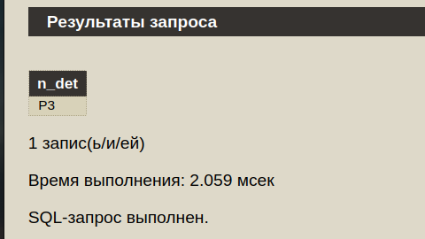
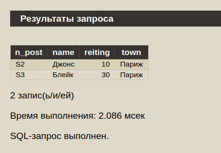
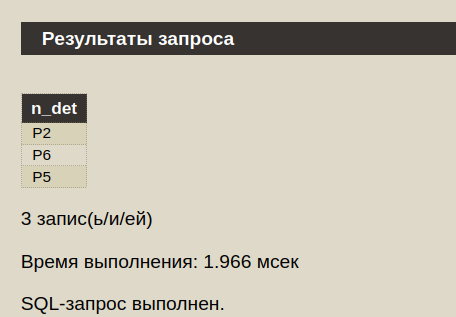
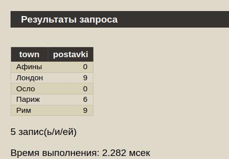
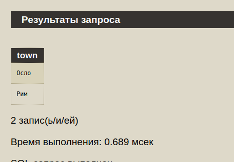
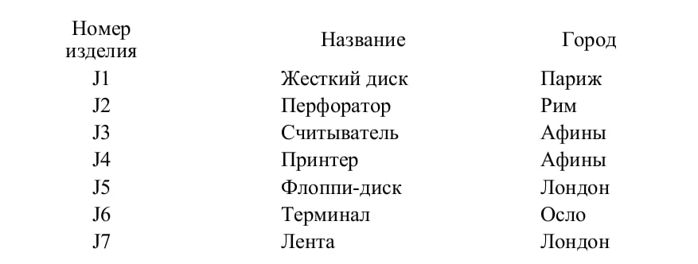
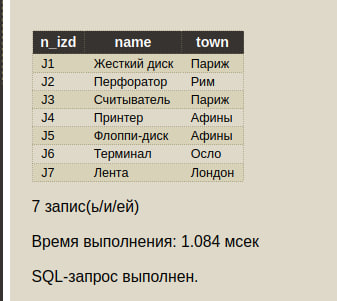

# Лабораторная работа 1 SQL

####  1) Выбрать детали, поставлявшиеся для изделий, для которых по-ставщик S3 поставлял детали из Рима.

SELECT DISTINCT t.n_det FROM spj t
WHERE t.n_det IN 
(SELECT spj.n_det FROM spj
                  JOIN p ON p.n_det = spj.n_det
                  JOIN j ON spj.n_izd = j.n_izd
                  JOIN s ON spj.n_post = s.n_post
                  WHERE p.town = 'Рим' AND s.n_post = 'S3')

### 2) Найти поставщиков, которые поставляли детали с весом не мень-ше 17 для изделий из Рима. Вывести номер поставщика, фамилию, рей-тинг и город, где он проживает.

SELECT s.* FROM s
JOIN spj ON s.n_post = spj.n_post
JOIN p ON p.n_det = spj.n_det
JOIN j ON j.n_izd = spj.n_izd
WHERE p.ves < 17 AND j.town = 'Рим'

### 3) Получить список деталей, которые поставлялись ТОЛЬКО по-ставщиками, выполнившие поставки для изделия J7.

SELECT DISTINCT t.n_det FROM spj t
WHERE t.n_post IN
(SELECT DISTINCT spj.n_post FROM spj
 JOIN j ON spj.n_izd = j.n_izd 
 WHERE j.n_izd = 'J7')
EXCEPT 
SELECT DISTINCT t.n_det FROM spj t
WHERE t.n_post NOT IN
(SELECT DISTINCT spj.n_post FROM spj
 JOIN j ON spj.n_izd = j.n_izd 
 WHERE j.n_izd = 'J7')
 

### 4) Вывести полный список городов и для каждого города найти общее число поставок, выполненных из этого города. Города в списке должны быть ВСЕ. Список должен быть упорядочен по алфавиту.

SELECT town.town, COALESCE(pt.kol, 0) as postavki
FROM (
SELECT town FROM p
UNION 
SELECT town FROM s
UNION
SELECT town FROM j ) town
LEFT JOIN (SELECT p.town, COUNT(p.town) AS kol FROM spj
      JOIN p ON spj.n_det = p.n_det
      JOIN s ON spj.n_post = s.n_post
      GROUP BY 1) pt ON pt.town = town.town
ORDER BY 1

### 5) Построить таблицу с упорядоченным списком городов таких, что в городе производится какая-либо деталь или собирается какое-либо изделие, но не размещается ни один поставщик.

CREATE TABLE TOWN( town CHARACTER(6));
INSERT INTO town (
(SELECT town FROM j
UNION
SELECT town FROM p)
EXCEPT
SELECT town FROM s
ORDER BY 1)

SELECT * FROM TOWN

### 6) Каждое изделие с длиной названия > 10 перевести в город, в котором проживает первый по алфавиту поставщик деталей для этогоизделия.

UPDATE j
SET town = (
  SELECT s.town
  FROM spj
  INNER JOIN s ON spj.n_post = s.n_post
  WHERE spj.n_izd = j.n_izd
  ORDER BY s.name, j.town
  LIMIT 1
)
WHERE LENGTH(j.name) > 10;

after: 

before:
